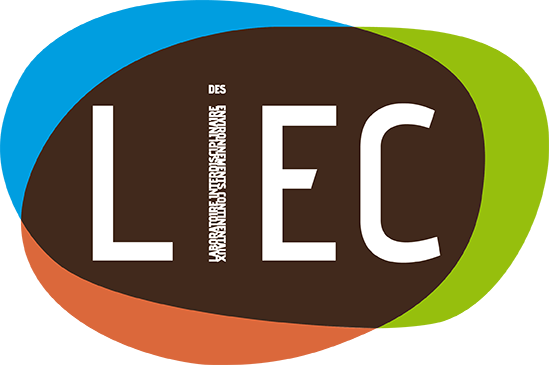
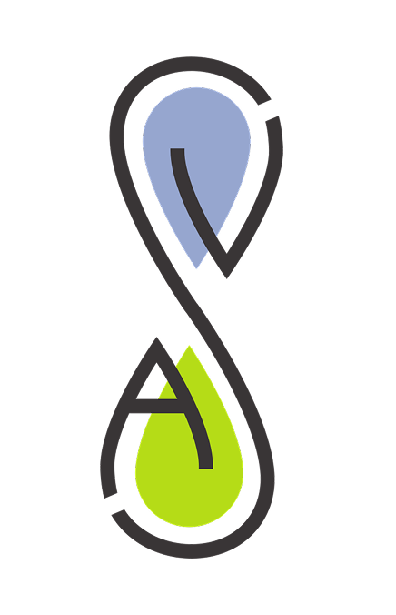
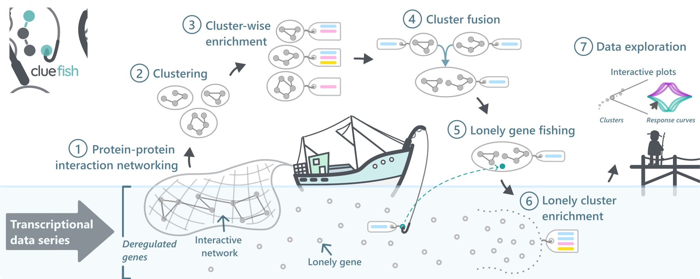

<br/>

## Education

::: {.content-visible when-format="html"}

**PhD — Bioinformatics & Ecotoxicology** [*2023 --- Present*]{.cvdate} <br> *Université de Lorraine* [{width="5%"}](https://www.univ-lorraine.fr/)

-   [Title]{.underline}: *"Analytical tool and toxicological interpretation keys for time- and dose-dependent transcriptomic responses: design based on the effect of di-butyl phthalate on Daphnia magna and Danio rerio"*
-   [Supervisors]{.underline}: Prof. [Marie Laure Delignette-Muller](https://www.vetagro-sup.fr/recherche-expertise/marie-laure-delignette-muller/) and Assoc. Prof. [Elise Billoir](https://liec.univ-lorraine.fr/presentation/membres/billoir-elise)
-   [Advisor]{.underline}: Assoc. Prof. [Sophie Prud'homme](https://liec.univ-lorraine.fr/presentation/membres/prudhomme-sophie)

**Master — Biodiversity, Ecology, and Evolution** [*2021 --- 2023*]{.cvdate} <br> *Université de Lyon 1* [{width="5%"}](https://www.univ-lyon1.fr/en)

-   [Topics]{.underline}: Biodiversity and functioning of ecosystems | Bioinformatics and Modelling in Ecology | Bayesian Statistics | Genomics in Ecology and Evolution | Parasitical and Mutualistic Interactions

**Bachelor — Life sciences** [*2018 --- 2021*]{.cvdate} <br> *Université de Lyon 1* [{width="5%"}](https://www.univ-lyon1.fr/en)

-   [Topics]{.underline}: Community and Microbial Ecology | Ecophysiology | Genetics and Population Dynamics | Molecular tools for Ecology and Evolution

---

:::

::: {.content-visible when-format="typst"}

```{=typst}

#cv-entry(
  title: "PhD — Bioinformatics & Ecotoxicology",
  location: "Université de Lorraine",
  date: "2023 — Present",
  description: [
    *Title:* _"Analytical tool and toxicological interpretation keys for time- and dose-dependent transcriptomic responses."_ \
    *Supervisors:* Prof. #link("https://www.vetagro-sup.fr/recherche-expertise/marie-laure-delignette-muller/")[Marie Laure Delignette-Muller] & Assoc. Prof. #link("https://liec.univ-lorraine.fr/presentation/membres/billoir-elise")[Elise Billoir]. \
    *Advisor:* Assoc. Prof. #link("https://liec.univ-lorraine.fr/presentation/membres/prudhomme-sophie")[Sophie Prud'homme].
  ]
)
#cv-entry(
  title: "Master — Biodiversity, Ecology, and Evolution",
  date: "2021 — 2023",
  location: "Université de Lyon 1",
  description: [
    *Topics:* Biodiversity and functioning of ecosystems · Bioinformatics and Modelling in Ecology · Bayesian Statistics · Genomics in Ecology and Evolution · Parasitical and Mutualistic Interactions.
  ]
)
#cv-entry(
  title: "Bachelor — Life sciences",
  date: "2018 — 2021",
  location: "Université de Lyon 1",
  description: [
    *Topics:* Community and Microbial Ecology · Ecophysiology · Genetics and Population Dynamics · Molecular tools for Ecology and Evolution.
  ]
)

#v(1em)
#line(start: (0%, 0%), end: (35%, 0%), stroke: (thickness: 1pt, paint: color-lightest-teal))
#v(4em)

```

:::

## Research Experience

::: {.content-visible when-format="html"}

### Doctoral Researcher {#doc-res}

[*2023 --- Present*]{.cvdate}

Labs --- <abbr title="Laboratoire Interdisciplinaire des Environnements Continentaux">[{width="8%"}](https://liec.univ-lorraine.fr/)</abbr> & <abbr title="Laboratoire Biométrie et Biologie Évolutive">[{width="12%"}](https://lbbe.univ-lyon1.fr/fr)</abbr> <br> Institutions --- Université de Lorraine [{width="5%"}](https://www.univ-lorraine.fr/) & VetAgroSup [{width="4%"}](https://www.vetagro-sup.fr/) <br> Project --- [ANR Chroco](https://anr.fr/Projet-ANR-21-CE34-0003)


[Title]{.underline}: *"Analytical tool and toxicological interpretation keys for time- and dose-dependent transcriptomic responses: design based on the effect of di-butyl phthalate on Daphnia magna and Danio rerio"*

This thesis sits at the interface of ecotoxicology and bioinformatics -- broadly ecotoxicogenomics --- developing methodological approaches for the analysis and interpretation of transcriptomic data modulated by two key variables: contaminant dose and exposure time. Work spans both a model organism (*Danio rerio*) and a non-model organism (*Daphnia magna*), the latter presenting specific challenges in genome annotation completeness and biological database coverage.

The project is structured around two main axes. The first produced [cluefish](https://github.com/ellfran-7/cluefish) — a workflow for structured biological interpretation of dose-response transcriptomic results, improving exploration of deregulated genes and their associated biological functions ([Franklin et al., 2025](https://doi.org/10.1093/nargab/lqaf103)).

{.lightbox fig-alt="Cluefish graphical abstract" width="50%"}

The second, currently in preparation, extends the DRomics framework to integrate time as an additional variable, enabling characterisation of gene expression patterns jointly modulated by dose and exposure duration, with dedicated visualisation strategies. A paper is currently in the works, and will be submitted this year (2026).

A transversal concern throughout is generalisability, reproducibility, and accessibility of the developed tools for the broader (eco)toxicology community.

For more info on my thesis, check [here](https://theses.fr/s370682).


[]{.smallbreak}

### Master's 2 Research Intern

[*Jan --- Jun 2023*]{.cvdate}

Lab --- <abbr title="Laboratoire Interdisciplinaire des Environnements Continentaux">[{width="8%"}](https://liec.univ-lorraine.fr/)</abbr> <br> Institution --- Université de Lyon 1 [{width="5%"}](https://www.univ-lyon1.fr/en)

[Title]{.underline}: *"From modelling dose-response transcriptomic data to biological interpretation: an application to embryonic exposure of Danio rerio to di-butly phthalate (DBP)"*

Initiated the early development of what would become [cluefish](https://github.com/ellfran-7/cluefish),
building a reproducible R workflow aimed at improving biological interpretation of DRomics
dose-response results on *Danio rerio*, with applicability to non-model organisms in mind.

A central motivation was addressing a core limitation of functional enrichment methods: the
tendency to produce results that are either overwhelmingly redundant or too sparse to be
interpretable. This drove a thorough exploration of the enrichment literature, critical evaluation of existing
approaches, and the design of a more informative strategy --- combining functional enrichment
with protein–protein interaction network construction and clustering (STRING, Cytoscape),
integration of multiple biological databases (KEGG, WikiPathways, AnimalTFDB), and
dose-response modelling metrics (benchmark doses, curve trends) --- to elucidate sensitive
mechanisms of action of DBP in zebrafish.

This subject carried on into my [PhD](#doc-res).

[]{.smallbreak}

### Master's 1 Research Intern

[*Apr --- Jun 2022*]{.cvdate}

Lab --- <abbr title="Laboratoire Biométrie et Biologie Évolutive">[{width="12%"}](https://lbbe.univ-lyon1.fr/fr)</abbr> <br> Institution --- Université de Lyon 1 [{width="5%"}](https://www.univ-lyon1.fr/en)

[Title]{.underline}: *"Development of a dose-response analysis on transcriptomic data to better understand the chronic effects of ionising radiation at low doses"*

A first encounter with dose-response modelling applied to transcriptomic data, using
[DRomics](https://lbbe-software.github.io/DRomics/) to reanalyse published RNA-seq data
from zebrafish (*Danio rerio*) embryos chronically exposed to ionising radiation across a
dose gradient. The work addressed batch effect correction in multi-replicate genomic data,
and explored what a concentration-dependent framework adds over classical comparative
approaches --- including the characterisation of dose-response relationships and computation
of benchmark doses (BMDs) as points of departure for ecological risk assessment.

---

:::

::: {.content-visible when-format="typst"}

```{=typst}

#cv-entry(
  title: "Doctoral Researcher",
  location: "LIEC & LBBE",
  date: "2023 — Present",
  description: [
    *Labs:* #link("https://liec.univ-lorraine.fr/")[LIEC] & #link("https://lbbe.univ-lyon1.fr/fr")[LBBE] · *Institutions:* Université de Lorraine & VetAgroSup · *Project:* #link("https://anr.fr/Projet-ANR-21-CE34-0003")[ANR Chroco] \
    Ecotoxicogenomics thesis developing methodological approaches for analysis and interpretation of transcriptomic data modulated by contaminant dose and exposure time, across model (_Danio rerio_) and non-model (_Daphnia magna_) organisms. \
    *Axis 1:* #link("https://github.com/ellfran-7/cluefish")[cluefish] — a workflow for structured biological interpretation of dose-response transcriptomic results (#link("https://doi.org/10.1093/nargab/lqaf103")[Franklin et al., 2025]). \
    *Axis 2:* Extension of DRomics to time-dose-response data (in preparation, 2026). \
    More info: #link("https://theses.fr/s370682")[theses.fr/s370682].
  ]
)
#cv-entry(
  title: "Master's 2 Research Intern",
  location: "LIEC, Université de Lyon 1",
  date: "Jan — Jun 2023",
  description: [
    *Title:* _"From modelling dose-response transcriptomic data to biological interpretation: an application to embryonic exposure of Danio rerio to DBP."_ \
    Early development of #link("https://github.com/ellfran-7/cluefish")[cluefish], addressing redundancy limitations of functional enrichment by combining ORA with PPIN construction and clustering (STRING, Cytoscape), biological databases (KEGG, WikiPathways, AnimalTFDB), and dose-response modelling metrics (BMDs, curve trends).
  ]
)
#cv-entry(
  title: "Master's 1 Research Intern",
  location: "LBBE, Université de Lyon 1",
  date: "Apr — Jun 2022",
  description: [
    *Title:* _"Development of a dose-response analysis on transcriptomic data to better understand the chronic effects of ionising radiation at low doses."_ \
    First encounter with dose-response modelling applied to transcriptomic data, using #link("https://lbbe-software.github.io/DRomics/")[DRomics] to reanalyse RNA-seq data from _Danio rerio_ embryos chronically exposed to ionising radiation. Addressed batch effect correction and explored the added value of a concentration-dependent framework, including BMD computation for ecological risk assessment.
  ]
)
#v(1em)
#line(start: (0%, 0%), end: (35%, 0%), stroke: (thickness: 1pt, paint: color-lightest-teal))
#v(4em)

```

:::

## Publications

::: {.content-visible when-format="html"}

### Peer-reviewed articles

```{r}
#| output: asis
#| echo: false
#| message: false
#| warning: false

library(rorcid)
library(rcrossref)
library(glue)

# Configuration ---
my_orcid <- "0000-0002-6614-4109"

github_links <- list(
  "10.1093/nargab/lqaf103" = "https://github.com/ellfran-7/cluefish"
)

# Helpers ---
get_doi <- function(x) {
  if (is.null(x)) return(NA)
  doi <- x$`external-id-value`[x$`external-id-type` == "doi"]
  if (length(doi) == 0) return(NA)
  doi[1]
}

get_preprint_doi <- function(article_title, preprints) {
  if (nrow(preprints) == 0) return(NA)
  preprint_dois   <- sapply(preprints$`external-ids.external-id`, get_doi)
  preprint_titles <- preprints$`title.title.value`
  match_idx <- which(agrepl(article_title, preprint_titles,
                            ignore.case = TRUE, max.distance = 0.2))
  if (length(match_idx) == 0) return(NA)
  preprint_dois[match_idx[1]]
}

format_authors <- function(authors_df) {
  author_strings <- paste(authors_df$given, authors_df$family)
  ifelse(
    grepl("Ellis", authors_df$given) & grepl("Franklin", authors_df$family),
    paste0("**", author_strings, "**"),
    author_strings
  ) |> paste(collapse = ", ")
}

# Fetch data ---
all_works  <- orcid_works(my_orcid)[[1]]$works
articles   <- all_works[all_works$type == "journal-article", ]
preprints  <- all_works[all_works$type == "preprint", ]

# Render ---
for (i in seq_len(nrow(articles))) {
  doi <- get_doi(articles$`external-ids.external-id`[[i]])
  if (is.na(doi)) next

  meta <- tryCatch(cr_works(dois = doi)$data, error = function(e) NULL)
  if (is.null(meta)) next

  title <- meta$title
  journal <- meta$container.title
  year <- substr(meta$issued, 1, 4)
  vol <- suppressWarnings(if (!is.null(meta$volume) && !is.na(meta$volume)) meta$volume else "")
  iss <- suppressWarnings(if (!is.null(meta$issue)  && !is.na(meta$issue))  glue("({meta$issue})") else "")
  pages <- suppressWarnings(if (!is.null(meta$page) && !is.na(meta$page)) glue(", {meta$page}") else "")

  author_list <- format_authors(meta$author[[1]])

  # Build links
  links <- glue("[DOI](https://doi.org/{doi})")

  preprint_doi <- get_preprint_doi(title, preprints)
  if (!is.na(preprint_doi)) {
    links <- paste(links, glue("[Preprint](https://doi.org/{preprint_doi})"), sep = " · ")
  }

  if (doi %in% names(github_links)) {
    links <- paste(links, glue("[GitHub]({github_links[[doi]]})"), sep = " · ")
  }

  cat(glue("- {author_list} ({year}). {title}. *{journal}*, {vol}{iss}{pages}. {links}"), "\n\n")
}
```

::: {.small .text-muted style="font-size: 0.8em; color: #999; margin-top: 0.5em;"}
*Publication list automatically retrieved from [ORCID](https://orcid.org/0000-0002-6614-4109) and [Crossref](https://www.crossref.org/) on `r format(Sys.Date(), "%B %d, %Y")`.*
:::

---

:::


<!-- THIS CODE WAS A START OF EXPLORATION IN FORMATTING THE DYNAMIC PAPER RETRIEVAL TO TYPST -->
<!-- AS OF NOW, NOT EASY -->
<!-- ```{r} -->
<!-- #| echo: false -->
<!-- #| message: false -->
<!-- #| warning: false -->
<!-- #| output: asis -->

<!-- if (knitr::pandoc_to("typst")) { -->
<!--   lines <- c() -->

<!--   for (i in seq_len(nrow(articles))) { -->
<!--     doi <- get_doi(articles$`external-ids.external-id`[[i]]) -->
<!--     if (is.na(doi)) next -->

<!--     meta <- tryCatch(cr_works(dois = doi)$data, error = function(e) NULL) -->
<!--     if (is.null(meta)) next -->

<!--     title   <- meta$title -->
<!--     journal <- meta$container.title -->
<!--     year    <- suppressWarnings(substr(meta$issued, 1, 4)) -->
<!--     vol     <- suppressWarnings(if (!is.null(meta$volume) && !is.na(meta$volume)) meta$volume else "") -->
<!--     iss     <- suppressWarnings(if (!is.null(meta$issue)  && !is.na(meta$issue))  glue("({meta$issue})") else "") -->
<!--     pages   <- suppressWarnings(if (!is.null(meta$page)   && !is.na(meta$page))   glue(", {meta$page}") else "") -->

<!--     authors_df <- meta$author[[1]] -->
<!--     author_strings <- paste(substr(authors_df$given, 1, 1), authors_df$family, sep = ". ") -->
<!--     author_list <- paste(author_strings, collapse = ", ") -->

<!--     desc <- glue("{author_list} ({year}). {title}. {journal}, {vol}{iss}{pages}. doi:{doi}") -->

<!--     lines <- c(lines, glue('#cv-entry(title: "Peer-reviewed articles", description: "{desc}")')) -->
<!--   } -->

<!--   lines <- c(lines, -->
<!--     '#v(1em)', -->
<!--     '#line(start: (0%, 0%), end: (35%, 0%), stroke: (thickness: 1pt, paint: color-lightest-teal))', -->
<!--     '#v(4em)' -->
<!--   ) -->

<!--   # CRITICAL: \n ensures Pandoc sees these as isolated block-level elements -->
<!--   cat("\n```{=typst}\n") -->
<!--   cat(paste(lines, collapse = "\n")) -->
<!--   cat("\n```\n") -->
<!-- } -->
<!-- ``` -->

::: {.content-visible when-format="typst"}

```{=typst}

#cv-entry(
  title: "Peer-reviewed articles",
  description: [
    J. Ohanessian, S. M. Prud'homme, *E. Franklin*, G. Kitzinger, C. Lorgeoux, E. Billoir, V. Felten (2025). _Effects of dibutyl phthalate (DBP) on life history traits and population dynamics of Daphnia magna: comparison of two exposure regimes._ Peer Community Journal, 5. #link("https://doi.org/10.24072/pcjournal.586")[DOI] · #link("https://doi.org/10.1101/2025.03.05.641620")[Preprint] \
    *E. Franklin*, E. Billoir, P. Veber, J. Ohanessian, M. L. Delignette-Muller, S. M. Prud'homme (2025). _Cluefish: mining the dark matter of transcriptional data series with over-representation analysis enhanced by aggregated biological prior knowledge._ NAR Genomics and Bioinformatics, 7(3). #link("https://doi.org/10.1093/nargab/lqaf103")[DOI] · #link("https://doi.org/10.1101/2024.12.18.627334")[Preprint] · #link("https://github.com/ellfran-7/cluefish")[GitHub]
  ]
)
#v(1em)
#line(start: (0%, 0%), end: (35%, 0%), stroke: (thickness: 1pt, paint: color-lightest-teal))
#v(4em)
```

:::


## Communications

::: {.content-visible when-format="html"}

### Oral Presentations

#### International

- **Ellis Franklin**, Marie-Laure Delignette-Muller, Elise Billoir, Sophie Prud'Homme (2024). *Interests and constraints towards unravelling endocrine disruptors mechanisms using dose-response transcriptomic data: application to the impact of di-n-butyl phthalate on zebrafish*. 22nd Pollutant Responses in Marine Organisms (PRIMO22), Nantes, France. [HAL](https://hal.science/hal-05282728)

- **Ellis Franklin**, Elise Billoir, Philippe Veber, Jérémie Ohanessian, Marie Laure Delignette-Muller, Sophie Prud'Homme (2025). *Exploring transcriptomic data with over-representation analysis enhanced by aggregated biological prior knowledge*. 35th Society of Environmental Toxicology and Chemistry (SETAC 2025), Vienna, Austria. [HAL](https://hal.science/hal-05283494)

- **Ellis Franklin**, Sophie Prud'Homme, Jérémie Ohanessian, Elise Billoir, Marie Laure Delignette-Muller (2026). *Développement d’une méthode d’analyse intégrative de données transcriptomiques temps-dose-réponse* (ENG : *Development of an integrated analysis method for time-dose-repsonse transcriptomic data*). ECOBIM, Le Havre, France.

#### National

- **Ellis Franklin**, Jérémie Ohanessian, Elise Billoir, Marie Laure Delignette-Muller, Sophie Prud'Homme (2023). *Chronologie des effets et des réactions face à une exposition à un contaminant : de la réponse moléculaire à apicale*. GDR Ecotox Aqua 2023, Metz, France.

- **Ellis Franklin**, Elise Billoir, Philippe Veber, Jérémie Ohanessian, Marie Laure Delignette-Muller, Sophie Prud'Homme (2024). *Cluefish: exploration of transcriptomic data with over-representation analysis enhanced by aggregated biological prior knowledge*. GDR Ecotox Aqua 2024, Grenoble, France.

- **Ellis Franklin**, Sophie Prud'Homme, Jérémie Ohanessian, Elise Billoir, Marie Laure Delignette-Muller (2025). *Unravelling transcriptomic response dynamics in ecotoxicology*. GDR Ecostat, Metz, France.

#### Local & Internal

- **Ellis Franklin**, Elise Billoir, Philippe Veber, Jérémie Ohanessian, Marie Laure Delignette-Muller, Sophie Prud'Homme (2026). *Cluefish: a workflow to make sense of transcriptomic dose-response data in ecotoxicology*. LBBE Internal Seminar, Lyon, France.

- **Ellis Franklin** (2025). *Reproducible Research: Every little helps*. LEHNA Seminar, Lyon, France. [Slides](https://ellfran-7.github.io/repro-research-presentation/) · [GitHub](https://github.com/ellfran-7/repro-research-presentation)

### Posters

- **Ellis Franklin**, Elise Billoir, Marie Laure Delignette-Muller, Sophie Prud'Homme (2024). *From dose-response modelling of transcriptomic data to biological interpretation: an application to embryonic exposure of zebrafish (Danio rerio) to di-n-butyl phthalate (DBP)*. 22nd Pollutant Responses in Marine Organisms (PRIMO22), Nantes, France. [HAL](https://hal.science/hal-05282671)


---

:::

::: {.content-visible when-format="typst"}

```{=typst}

#cv-entry(
  title: "Oral — International",
  description: [
    *E. Franklin* et al. (2024). _Interests and constraints towards unravelling endocrine disruptors mechanisms using dose-response transcriptomic data_. PRIMO22, Nantes, France. #link("https://hal.science/hal-05282728")[HAL] \
    *E. Franklin* et al. (2025). _Exploring transcriptomic data with over-representation analysis enhanced by aggregated biological prior knowledge_. SETAC Europe, Vienna, Austria. #link("https://hal.science/hal-05283494")[HAL] \
    *E. Franklin* et al. (2026). _Développement d’une méthode d’analyse intégrative de données transcriptomiques temps-dose-réponse_ (ENG: _Development of an integrated analysis method for time-dose-repsonse transcriptomic data_). ECOBIM, Le Havre, France.
  ]
)
#cv-entry(
  title: "Oral — National",
  description: [
    *E. Franklin* et al. (2023). _Chronologie des effets et des réactions face à une exposition à un contaminant_. GDR Ecotox Aqua 2023, Metz, France. \
    *E. Franklin* et al. (2024). _Cluefish: exploration of transcriptomic data with over-representation analysis enhanced by aggregated biological prior knowledge_. GDR Ecotox Aqua 2024, Grenoble, France. \
    *E. Franklin* et al. (2025). _Unravelling transcriptomic response dynamics in ecotoxicology_. GDR Ecostat, Metz, France.
  ]
)
#cv-entry(
  title: "Oral — Local & Internal",
  description: [
    *E. Franklin* et al. (2026). _Cluefish: a workflow to make sense of transcriptomic dose-response data in ecotoxicology_. LBBE Internal Seminar, Lyon, France. \
    *E. Franklin* (2025). _Reproducible Research: Every little helps_. LEHNA Seminar, Lyon, France. #link("https://ellfran-7.github.io/repro-research-presentation/")[Slides] · #link("https://github.com/ellfran-7/repro-research-presentation")[GitHub]
  ]
)
#cv-entry(
  title: "Posters",
  description: [
    *E. Franklin* et al. (2024). _From dose-response modelling of transcriptomic data to biological interpretation: an application to embryonic exposure of zebrafish to DBP_. PRIMO22, Nantes, France. #link("https://hal.science/hal-05282671")[HAL]
  ]
)
#v(1em)
#line(start: (0%, 0%), end: (35%, 0%), stroke: (thickness: 1pt, paint: color-lightest-teal))
#v(4em)
```

:::


## Awards

::: {.content-visible when-format="html"}

- 2024: **Best Oral Presentation Prize**, *PRIMO22 Scientific Committee (Ifremer), Nantes, France*
- 2024: **Best Illustration of Work**, *DocDay, LIEC, Nancy, France*

---

:::

::: {.content-visible when-format="typst"}

```{=typst}

#cv-entry(
  title: "2024",
  description: [
    *Best Oral Presentation Prize*, _PRIMO22 Scientific Committee (Ifremer)_, Nantes, France. \
    *Best Illustration of Work*, _DocDay, LIEC_, Nancy, France.
  ]
)
#v(1em)
#line(start: (0%, 0%), end: (35%, 0%), stroke: (thickness: 1pt, paint: color-lightest-teal))
#v(4em)
```

:::


## Teaching & Supervision

::: {.content-visible when-format="html"}

### Teaching Assistant

[*2024*]{.cvdate}

Institution --- Université de Lorraine [{width="5%"}](https://www.univ-lorraine.fr/)

Teaching and practical work for Master 2 students (16h): *R programming, ggplot2, and Quarto*

[]{.smallbreak}

### Workshops

**A Step Towards Reproducible Research: Literate Programming** [*Feb 6, 2025*]{.cvdate} <br>
*CS-Workshop of ANTRE (ANimation TRansEquipes) --- <abbr title="Laboratoire Interdisciplinaire des Environnements Continentaux">[{width="8%"}](https://liec.univ-lorraine.fr/)</abbr>, Metz & Nancy*

Full-day interactive workshop designed and delivered independently for the members of the LIEC lab (Metz and Nancy sites). Organised in collaboration with Elise Billoir.

The workshop was structured in two parts: a discussion-based introduction around "reproducibility" and its challenges in research, followed by a hands-on session with Quarto for literate programming. Accessible to all lab members regardless of coding background, and open to non-French speakers. 

::: {.callout-note appearance="simple" collapse="true"}
## Personal note

This was my first experience building and leading a workshop, and I loved it. Many researchers shared their experience with difficulty reproducing results. As a strong advocate of reproducible research, I had loads of fun sharing what I know on the topic, especially in an interactive and open-discussion format --- and I'd love to do more of this.
:::

[Workshop site](https://ellfran-7.github.io/repro-research-workshop/) · [Materials](https://github.com/ellfran-7/repro-research-workshop)

[]{.smallbreak}

**Reproducible Research: Every little helps?** [*Feb 21, 2026*]{.cvdate} <br>
*Student Seminar --- <abbr title="Laboratoire Biométrie et Biologie Évolutive">[{width="12%"}](https://lbbe.univ-lyon1.fr/fr)</abbr>, Lyon*

Half-day interactive seminar delivered for the LBBE **Student Seminar** series, organised by non-permanent researchers ([Les Pinsons Migrateurs](https://lbbe.univ-lyon1.fr/en/les-pinsons-migrateurs)). Built on the LIEC workshop and a previous presentation given at <abbr title="Laboratoire d'Ecologie des Hydrosystèmes Naturels et Anthropisés">[LEHNA](https://umr5023.univ-lyon1.fr/)</abbr> in September 2025.

The seminar covered the what, why, and how of reproducible research --- its history, terminology, and best practices --- drawing both from the literature and from personal experience across the full data analysis workflow. Designed to be discussion-driven, with interactive elements throughout (Wooclap polls, drawing exercises) to encourage exchange and reflection among participants.

::: {.callout-note appearance="simple" collapse="true"}
## Personal note

The subject was similar to my first workshop, but it felt like a completely different experience --- different audience, different energy. Discussions were more intimate, with a lot of back-and-forth with young researchers and interns. It felt less like teaching and more like just talking about something I care about with people who are at the beginning of figuring it all out. I really enjoyed it!
:::

[Seminar site](https://ellfran-7.github.io/repro-research-student-seminar-lbbe/) · [Material](https://github.com/ellfran-7/repro-research-student-seminar-lbbe)

[]{.smallbreak}

### Student Co-supervision
[*2024*]{.cvdate}
Co-supervision of Master 2 internship <br> <abbr title="Laboratoire Interdisciplinaire des Environnements Continentaux">[{width="8%"}](https://liec.univ-lorraine.fr/)</abbr>, Metz

*"Chronic dose-response exposure of Daphnia magna to dibutyl phthalate at
various exposure durations: development and application of a
respirometry test and monitoring of eye development"*

---

:::

::: {.content-visible when-format="typst"}

```{=typst}

#cv-entry(
  title: "Teaching Assistant",
  location: "Université de Lorraine",
  date: "2024",
  description: [
    Practical work for Master 2 students (16h): *R programming, ggplot2, and Quarto.*
  ]
)
#cv-entry(
  title: "Workshop — LIEC",
  location: "Metz & Nancy",
  date: "Feb 6, 2025",
  description: [
    *A Step Towards Reproducible Research: Literate Programming.* Full-day interactive workshop designed and delivered independently for LIEC lab members (ANTRE initiative, organised with Elise Billoir). Structured in two parts: a discussion-based introduction to reproducibility challenges, followed by a hands-on Quarto session. #link("https://ellfran-7.github.io/repro-research-workshop/")[Workshop site] · #link("https://github.com/ellfran-7/repro-research-workshop")[Materials]
  ]
)
#cv-entry(
  title: "Seminar — LBBE",
  location: "Lyon",
  date: "Feb 21, 2026",
  description: [
    *Reproducible Research: Every little helps?* Half-day interactive seminar for the LBBE Student Seminar series (#link("https://lbbe.univ-lyon1.fr/en/les-pinsons-migrateurs")[Les Pinsons Migrateurs]). Covered the what, why, and how of reproducible research with discussion-driven format and interactive elements (Wooclap polls, drawing exercises). #link("https://ellfran-7.github.io/repro-research-student-seminar-lbbe/")[Seminar site] · #link("https://github.com/ellfran-7/repro-research-student-seminar-lbbe")[Materials]
  ]
)
#cv-entry(
  title: "Student Co-supervision",
  location: "LIEC, Metz",
  date: "2024",
  description: [
    Co-supervision of Master 2 internship: _"Chronic dose-response exposure of Daphnia magna to dibutyl phthalate at various exposure durations: development and application of a respirometry test and monitoring of eye development."_
  ]
)
#v(1em)
#line(start: (0%, 0%), end: (35%, 0%), stroke: (thickness: 1pt, paint: color-lightest-teal))
#v(4em)
```

:::

## Training highlights

::: {.content-visible when-format="html"}

### Courses & Schools

**Best practices for reproducible research in numerical ecology** [*Nov 20--24, 2023*]{.cvdate} <br>
*CESAB-FRB & GDR EcoStat, Montpellier, France* — 38h

Whole week covering the full reproducible research stack: project organisation, Git/GitHub, literate programming with Quarto, pipeline optimisation with `targets`, package development, dependency management with `renv`, and containerisation with Docker.

### MOOCs & Online Certifications

- **Reproducible research : Methodological Principles for Open Science** — *France Université Numérique / Inria* [*2024*]{.cvdate} <br>
  Success badge · 24h · Reproducible research principles, computational notebooks (Jupyter, RStudio), version control with GitLab.

---

:::

::: {.content-visible when-format="typst"}

```{=typst}

#cv-entry(
  title: "Best practices for reproducible research in numerical ecology",
  location: "CESAB-FRB & GDR EcoStat, Montpellier",
  date: "Nov 20–24, 2023",
  description: [
    Whole 38h training week co-organised by #link("https://www.fondationbiodiversite.fr/la-frb-en-action/programmes-et-projets/le-cesab/")[CESAB-FRB] and #link("https://sites.google.com/site/gdrecostat/")[GDR EcoStat]. Covered the full reproducible research stack: project organisation, Git/GitHub, literate programming with Quarto, pipeline optimisation with `targets`, package development, dependency locking with `renv`, and containerisation with Docker.
  ]
)
#cv-entry(
  title: "Reproducible research : Methodological Principles for Open Science",
  location: "France Université Numérique / Inria",
  date: "2024",
  description: [
    Success · 24h · Reproducible research principles, computational notebooks (Jupyter, RStudio), version control with GitLab.
  ]
)
#v(1em)
#line(start: (0%, 0%), end: (35%, 0%), stroke: (thickness: 1pt, paint: color-lightest-teal))
#v(4em)
```

:::

## Skills

::: {.content-visible when-format="html"}

### Computational & Programming

- **Languages:** R (advanced), Python (beginner–intermediate), Bash
- **Reproducible research:** Quarto, R Markdown, `renv`, `targets`, Git · GitHub / GitLab / Codeberg
- **Web & documents:** HTML, CSS, Typst, Markdown
- **Software development:** Developed [cluefish](https://github.com/ellfran-7/cluefish) --- an R workflow distributed as a structured, fully documented repository

### Bioinformatics

- **RNA-seq preprocessing:** Salmon, Kallisto, HISAT2
- **Differential expression & dose-response:** `DESeq2`, `edgeR`, `DRomics`
- **Biological databases & annotation:** Retrieval and cross-referencing of biological 
  annotations across levels (transcripts, genes, proteins) using biomaRt, KEGG, GO and 
  related resources; identifier conversion and mapping across annotation systems
- **Functional enrichment:** Hands-on experience across enrichment generations --- ORA, FCS,
  and pathway topology-based approaches --- using gprofiler2, clusterprofiler, topGO, DAVID,
  and others; co-weighted gene network analysis (WGCNA)
- **Network biology:** Protein–protein interaction network construction and visualisation
  (STRING, Cytoscape); PPIN clustering with multiple algorithms
- **Data visualisation:** `ggplot2`, `patchwork`; interactive figures with `plotly`; 
  integrated into reproducible Quarto reports

### Statistics & Modelling

- **Dose-response modelling**: 
    - selection of significantly responsive items (ANOVA, linear and quadratic 
  trend tests via limma/DESeq2, including development of custom trend tests)
    - dose-response curve fitting and model selection
    - benchmark dose (BMD) computation
    - non-parametric bootstrapping
- Multivariate analyses, cluster analysis and trees

### Languages
- **French:** Native
- **English:** Fluent (professional --- writing, presenting, teaching)


---

:::

::: {.content-visible when-format="typst"}

```{=typst}

#cv-entry(
  title: "Computational & Programming",
  description: [
    *Languages:* R (advanced), Python (beginner–intermediate), Bash \
    *Reproducible research:* Quarto, R Markdown, `renv`, `targets`, Git · GitHub / GitLab / Codeberg \
    *Web & documents:* HTML, CSS, Typst, Markdown \
    *Software development:* Developed #link("https://github.com/ellfran-7/cluefish")[cluefish] — a structured, fully documented R workflow.
  ]
)
#cv-entry(
  title: "Bioinformatics",
  description: [
    *RNA-seq preprocessing:* Salmon, Kallisto, HISAT2 \
    *Differential expression & dose-response:* `DESeq2`, `edgeR`, `DRomics` \
    *Annotation:* biomaRt, KEGG, GO; identifier mapping across transcripts, genes, proteins \
    *Functional enrichment (ORA, FCS, pathway topology):* gprofiler2, clusterProfiler, topGO, DAVID; WGCNA \
    *Network biology:* PPIN construction and clustering (STRING, Cytoscape) \
    *Data visualisation:* `ggplot2`, `patchwork`, `plotly` integrated in Quarto reports.
  ]
)
#cv-entry(
  title: "Statistics & Modelling",
  description: [
    *Dose-response modelling:* item selection (ANOVA, linear/quadratic trend tests, custom trend tests), curve fitting and model selection, BMD computation, non-parametric bootstrapping \
    Multivariate analyses, cluster analysis and trees.
  ]
)
#cv-entry(
  title: "Languages",
  description: [
    *French:* Native · *English:* Fluent (professional — writing, presenting, teaching).
  ]
)
#v(1em)
#line(start: (0%, 0%), end: (35%, 0%), stroke: (thickness: 1pt, paint: color-lightest-teal))
#v(4em)
```

:::

## Service

::: {.content-visible when-format="html"}

### Institutional

- **PhD Representative**, <abbr title="Laboratoire Interdisciplinaire des Environnements Continentaux">[{width="8%"}](https://liec.univ-lorraine.fr/)</abbr> [*2023 --- 2025*]{.cvdate} <br>

### Peer Review

- **Reviewer for**
    - [*Nucleic Acids Research*](https://academic.oup.com/nar)

### Memberships

- <abbr title="Société Française de Bioinformatique">[SFBI](https://www.sfbi.fr/)</abbr>
- <abbr title="Groupe de Recherche Statistique et Omique">[GDR StatOmique](https://statomique.github.io/)</abbr>
- <abbr title="Groupe de Recherche Écologie Statistique">[GDR EcoStat](https://sites.google.com/site/gdrecostat/)</abbr>
- [SETAC Omics Interest Group](https://www.setac.org/group/omics.html)


---

:::

::: {.content-visible when-format="typst"}

```{=typst}

#cv-entry(
  title: "PhD Representative",
  location: "LIEC, Université de Lorraine",
  date: "2023 — 2025",
  description: [
    Represented doctoral researchers at the lab level for two years.
  ]
)
#cv-entry(
  title: "Peer Review",
  description: [
    Reviewer for #link("https://academic.oup.com/nar")[_Nucleic Acids Research_].
  ]
)
#cv-entry(
  title: "Memberships",
  description: [
    #link("https://www.sfbi.fr/")[SFBI] (Société Française de Bioinformatique) · #link("https://statomique.github.io/")[GDR StatOmique] · #link("https://sites.google.com/site/gdrecostat/")[GDR EcoStat] · #link("https://www.setac.org/group/omics.html")[SETAC Omics Interest Group]
  ]
)
#v(1em)
#line(start: (0%, 0%), end: (35%, 0%), stroke: (thickness: 1pt, paint: color-lightest-teal))
#v(4em)
```

:::

## Outreach & Science Communication

::: {.content-visible when-format="html"}

### Workshops

- **Workshop Facilitator** --- *DRomics: Dose-Response Curves for Omics* [*2024*]{.cvdate} <br>
  GDR Ecotox Aqua, France.

### Science Festivals

- **Fête de la Science** [*Oct 10--12, 2024*]{.cvdate} <br>
  Université de Lorraine [{width="5%"}](https://www.univ-lorraine.fr/) / <abbr title="Laboratoire Interdisciplinaire des Environnements Continentaux">[{width="8%"}](https://liec.univ-lorraine.fr/)</abbr>, Metz, France. <br>
  Co-organised and facilitated a 3-day public outreach event titled *"Prédateurs et Proies : dans l'océan, l'exemple des requins et des maquereaux"*, aimed at school groups and general audiences. Designed and ran a board game and simulation game to explain predator-prey dynamics.

---

:::

::: {.content-visible when-format="typst"}

```{=typst}

#cv-entry(
  title: "Workshop Facilitator",
  location: "GDR Ecotox Aqua, France",
  date: "2024",
  description: [
    *DRomics: Dose-Response Curves for Omics.*
  ]
)
#cv-entry(
  title: "Fête de la Science",
  location: "LIEC, Metz, France",
  date: "Oct 10–12, 2024",
  description: [
    Co-organised and facilitated a 3-day public outreach event titled _"Prédateurs et Proies : dans l'océan, l'exemple des requins et des maquereaux"_, aimed at school groups and general audiences. Designed and ran a board game and simulation game to explain predator–prey dynamics.
  ]
)
#v(1em)
#line(start: (0%, 0%), end: (35%, 0%), stroke: (thickness: 1pt, paint: color-lightest-teal))
#v(4em)
```

:::
